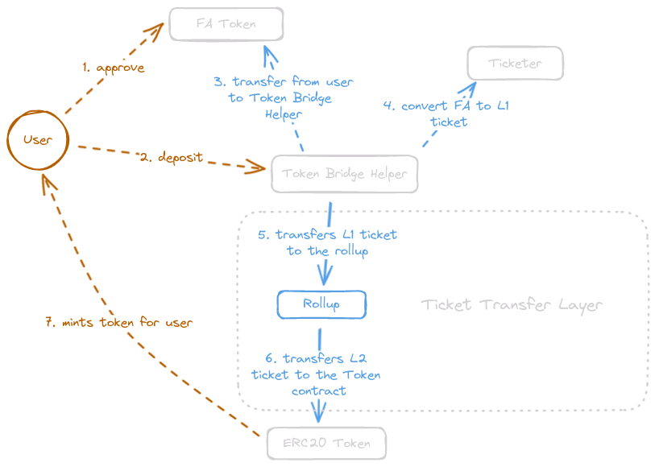

# Etherlink Bridge

This repository demonstrates the implementation of a bridge connecting Tezos and Etherlink, adhering to the [TZIP-029](https://gitlab.com/baking-bad/tzip/-/blob/wip/029-etherlink-token-bridge/drafts/current/draft-etherlink-token-bridge/etherlink-token-bridge.md) standard.

On the Tezos side, the setup includes smart contracts written in [CameLIGO](https://ligolang.org/docs/intro/introduction?lang=cameligo), featuring:
- [**Ticketer**](tezos/contracts/ticketer/ticketer.mligo), which facilitates the wrapping of **FA1.2** and **FA2** tokens into tickets. These tickets can then be sent to the bridge using a permissionless ticket transport mechanism.
- [**TicketHelper**](tezos/contracts/ticket-helper/ticket-helper.mligo), designed to allow users to transfer tickets even without the support for the **ticket_transfer** operation in the current Tezos infrastructure.

On the Etherlink side, the setup includes Solidity contracts, notably the **ERC20Proxy**: an ERC20 contract that implements the L2 proxy [deposit interface](https://gitlab.com/baking-bad/tzip/-/blob/wip/029-etherlink-token-bridge/drafts/current/draft-etherlink-token-bridge/etherlink-token-bridge.md#l2-proxy-deposit-interface) and [withdraw interface](https://gitlab.com/baking-bad/tzip/-/blob/wip/029-etherlink-token-bridge/drafts/current/draft-etherlink-token-bridge/etherlink-token-bridge.md#l2-proxy-withdraw-interface).

Additionally, the [scripts](scripts/) directory contains Python scripts designed for interacting with the bridge. These scripts facilitate various operations, including contract deployment on both sides of the bridge, as well as deposit and withdrawal functions.

The most straightforward method to engage with the components, execute scripts, and observe the interaction between different parts of the bridge is by running the demo notebook. It is set up to run in Google Colab's cloud environment. You can access it here: [](https://colab.research.google.com/github/baking-bad/etherlink-bridge/blob/feat/scripts-and-docs/etherlink_bridge_demo.ipynb).

Alternatively, users can clone this Git repository, adhere to the [installation guide](#install-dependencies), and set up their environment by executing the following command:
```shell
poetry run init_wallets
```
This script prompts users to input their Tezos and Etherlink private and public keys. It also offers options to configure nodes for L1 and L2 communication. Default values are available, and testnet keys are included.

Users might need to fund their Tezos and Etherlink accounts to execute scripts that interact with the L1 and L2 sides.
- For funding accounts on the Tezos side, the Tezos [testnets faucet](https://faucet.nairobinet.teztnets.com/) can be used (TODO: Replace the faucet link with Ghostnet upon the bridge's activation in Ghostnet).
- To fund accounts on the Etherlink side, the native token bridge should be utilized (TODO: Insert a link to the native bridge when it becomes operational for our fork).

### Bridge Configuration (Listing New Token Pairs)
To configure the bridge for a new token (i.e., to list a new token pair), users need to engage with the **Ticket Transport Layer**. This critical component of the bridge facilitates the transfer of tickets between Tezos and Etherlink.



The **FA2** and **FA1.2** standard Tezos tokens are not inherently ticket-native. Therefore, to bridge these tokens, users must initially deploy a **Ticketer** contract on the Tezos side. This contract associates with the specific Tezos token and converts it into a ticket. Note that this contract is unnecessary for tokens that are ticket-native, such as those following the **FA2.1** standard.

NOTE: Upgrades to the Ticketer contract are highly unwanted. Ideally, it should be deployed once and remain unchanged indefinitely.

Once it's determined which tickets will bridge the token to Etherlink, users can deploy an **ERC20Proxy** – an ERC20 token integrated with L2 deposit and withdrawal interfaces for the bridge. This contract needs to be configured to recognize tickets from the **Ticketer** deployed initially. It should include the Ticketer address and ticket content. With this configuration, the rollup kernel can call ERC20 to mint tokens for receiver corresponding to the incoming tickets from Tezos.

Additionally, deploying a **TicketHelper** on the Tezos side is required, targeting the specific **Token** and **Ticketer** pair. This deployment is crucial since wallets currently do not support the **transfer_ticket** operation. The **TicketHelper** streamlines the process by wrapping tokens into tickets and enabling their transfer to the rollup in a single transaction. Note, however, that this type of contract should become obsolete in the future when (1) wallets begin supporting the **transfer_ticket** operation and (2) Tezos undergoes a protocol upgrade that permits implicit addresses to transfer tickets with arbitrary data.

#### Deploying a Token
For demonstration purposes, users can deploy a test token intended for bridging. The bridge has been tested with two types of tokens available in the repository:
- The **FA1.2** standard **Ctez** token.
- The **FA2** standard **fxhash** token.

To deploy a token and allocate the total supply to the token's originator, the `deploy_token` command is used. It accepts various parameters, including `--token-type`, `--token-id`, and `--total-supply`, among others. The following example demonstrates how to deploy an **FA2** token type using default parameters:
```shell
poetry run deploy_token --token-type FA2
```
Here is a link to the resulting operation in the [Nairobinet TzKT](https://nairobinet.tzkt.io/op7QGDUcdujMRSHq4C9MDcKwUus9mA2mrXQ15Vc4nsm1NSDJuMU/928446).

#### Deploying a Ticketer
The `deploy_ticketer` command is used to deploy a ticketer for a specific token. It requires the `--token-address`, `--token-type`, and `--token-id` parameters to be provided. Below is an example that demonstrates how to deploy a ticketer for the **FA2** token previously deployed on Nairobinet:
```shell
poetry run deploy_ticketer --token-address KT1EMyCtaNPypSbz3qxuXmNZVfvhqifrf5MR --token-type FA2 --token-id 0
```
Here is a link to the resulting operation in the [Nairobinet TzKT](https://nairobinet.tzkt.io/ooVWNtZnUk2ZPiEaNh4daMQuyPQpdDV83x2BNxGZAT9BkSMwnd5/928447).

During the deployment of the Ticketer, users will obtain its parameters, which include **address_bytes** and **content_bytes**. These parameters are essential for the origination of the **ERC20Proxy**.

#### Deploying a Ticket Helper
To facilitate the interaction of Tezos wallets with specific tickets, users need to deploy a Ticket Helper. This is accomplished using the `deploy_ticket_helper` command, which requires the `--ticketer-address` parameter. The Ticketer's storage will be parsed to retrieve information about the token. Below is an example that illustrates deploying a ticket helper for the ticketer previously deployed on Nairobinet:
```shell
poetry run deploy_ticket_helper --ticketer-address KT1MauRYJiXxD7a8iZkhpdnc4jHu7iGGXDbs
```
Here is a link to the resulting operation in the [Nairobinet TzKT](https://nairobinet.tzkt.io/opZqJve5nKFcNHuZ3YofhVspYnSNzPLo6WsWhor2Zg4nENUVDmM/928448).

#### Deploying ERC20Proxy
To deploy a token contract on the Etherlink side capable of minting tokens upon deposit, the `deploy_erc20` command is used. This script requires the `--ticketer-address-bytes` and `--ticketer-content-bytes`, as well as `--token-name`, `--token-symbol`, and `--decimals` for the proper configuration of the L2 token contract. Below is an example that originates ERC20 contract connected to the ticketer previously deployed on Nairobinet:
```shell
poetry run deploy_erc20 --ticketer-address-bytes 018ea031e382d5be16a357753fb833e609c7d2dd9b00 --ticketer-content-bytes 0707000005090a0000007405020000006e07040100000010636f6e74726163745f616464726573730a0000001c050a00000016013f65105866518de12034c340e2b2f65d80780c580007040100000008746f6b656e5f69640a000000030500000704010000000a746f6b656e5f747970650a00000009050100000003464132 --token-name "FA2 Test Token" --token-symbol "FA2" --decimals 0
```
Here is a link to the resulting operation in the [Etherlink Blockscout](http://blockscout.dipdup.net/tx/0x41d7fc136882ef01a4497e9c9edec5b2fe05baa686c3d07199a432c65e181fc1).

NOTE: To retrieve the **ticketer-address-bytes** and **content-bytes** from an already deployed ticketer, users can utilize the script provided below:
```shell
poetry run get_ticketer_params --ticketer KT1MauRYJiXxD7a8iZkhpdnc4jHu7iGGXDbs
```

### Deposit
To initiate a deposit, users need to transfer Tickets to the rollup address, appending Routing Info in the [specified format](https://gitlab.com/baking-bad/tzip/-/blob/wip/029-etherlink-token-bridge/drafts/current/draft-etherlink-token-bridge/etherlink-token-bridge.md#deposit): a 40 bytes payload comprising `| receiver | proxy |`, where both receiver and proxy are standard Ethereum addresses in raw form (H160). The `deposit` command simplifies this process. It requires the Ticket Helper address (`--ticket-helper-address`), the Etherlink ERC20Proxy contract address (`--proxy-address`), and the bridged amount (`--amount`). Below is an example of how to execute this:
```shell
poetry run deposit --ticket-helper-address KT18nod2GU8PzYcrkspXz7dFkGisThZpgdLW --proxy-address 0x8554cD57C0C3E5Ab9d1782c9063279fA9bFA4680 --amount 777
```
Here is a link to the resulting operation in the [Nairobinet TzKT](https://nairobinet.tzkt.io/opRNngtr5dwYG6nJuXRAWXLPmE8Y17RgadwBQEtZfu3tfT9sxVv/928449) and [Etherlink Blockscout](http://blockscout.dipdup.net/tx/0xa34a41d8d5ca8e3019cb457c2a5b7f978ebf7193a72790fb6085b13ed2da1f66).

NOTE: This script executes two operations in a batch. The first operation grants approval to the **Ticket Helper** for the token, and the second operation invokes the **deposit** entrypoint of the **Ticket Helper**.

### Withdrawal Process
The withdrawal process consists of two steps:
1. Initiating the withdrawal on the Etherlink side, leading to the creation of an outbox message within the rollup commitment.
2. Finalizing the withdrawal on the Tezos side by executing the outbox message, subsequent to the settlement of the commitment.

#### Etherlink Withdrawal
To initiate a withdrawal on the Etherlink side, users must invoke the withdrawal precompile. This involves providing the **ERC20Proxy** address along with Routing Info in the [specified format](https://gitlab.com/baking-bad/tzip/-/blob/wip/029-etherlink-token-bridge/drafts/current/draft-etherlink-token-bridge/etherlink-token-bridge.md#withdrawal), which is a 44-byte concatenation of two forged contracts: `| receiver | proxy |`. A forged contract is comprised of a binary suffix/prefix and a body (a blake2b hash digest). A script is provided to streamline the withdrawal process. This script requires the **ERC20** contract address (which will burn tokens) as `--proxy-address`, the L1 **Router** address (which will receive the ticket from the rollup) as `--router-address`, and the bridged amount as `--amount`. Furthermore, `--ticketer-address-bytes` and `--ticketer-content-bytes` are required to enable the **ERC20Proxy** to validate the token before burning it.

NOTE: The **Ticketer** may serve as a **Router** during withdrawals, automatically unwrapping tickets for a specified `receiver`. For **FA2.1** and other ticket-native tokens, a specialized **Router** contract can be employed to directly route tickets to the `receiver` without unwrapping.

Below is an example demonstrating the execution of a script that initiates the withdrawal of 108 tokens previously deposited on Etherlink.
```shell
poetry run withdraw --proxy-address 0x8554cD57C0C3E5Ab9d1782c9063279fA9bFA4680 --amount 108 --ticketer-address-bytes 018ea031e382d5be16a357753fb833e609c7d2dd9b00 --ticketer-content-bytes 0707000005090a0000007405020000006e07040100000010636f6e74726163745f616464726573730a0000001c050a00000016013f65105866518de12034c340e2b2f65d80780c580007040100000008746f6b656e5f69640a000000030500000704010000000a746f6b656e5f747970650a00000009050100000003464132
```
Here is a link to the resulting operation in the [Etherlink Blockscout](http://blockscout.dipdup.net/tx/0xfc7e31241a44d3b23afdb41f5e69ecf4a8e3bc0e9f914039fe51beaa52400ed9).

#### Finalizing Tezos Withdrawal
To finalize the withdrawal process on the Tezos side, users must invoke the outbox message after it has been settled. This necessitates acquiring the **commitment** hash and **proof** bytes, which are obtainable from the rollup node using **outboxLevel** and **outboxMsgId**. These parameters are part of the **Withdrawal** event that is emitted during the withdrawal process on the Etherlink side.

Since both **outboxLevel** and **outboxMsgId** are of type `uint256`, to extract **outboxMsgId**, users should take the last 32 bytes from the **Withdrawal** event logs. For **outboxLevel**, the preceding 32 bytes should be taken and both should be converted into integers. Here's how this process can be executed:

- Link to the block explorer with the withdrawal transaction: [blockscout](http://blockscout.dipdup.net/tx/0xfc7e31241a44d3b23afdb41f5e69ecf4a8e3bc0e9f914039fe51beaa52400ed9/logs)
- **Withdrawal** event data: `0x000000000000000000000000befd2c6ffc36249ebebd21d6df6376ecf3bac4480000000000000000000000008554cd57c0c3e5ab9d1782c9063279fa9bfa468000008a7390072a389159c73687165cd7910e8a39160600000000000000000000000000000000000000000000000000000000000000000000000000000000006c00000000000000000000000000000000000000000000000000000000002920a70000000000000000000000000000000000000000000000000000000000000000`
- **outboxMsgId**: The last 32 bytes are `0000000000000000000000000000000000000000000000000000000000000000`, which is integer `0`.
- **outboxLevel**: The 32 bytes preceding those are `00000000000000000000000000000000000000000000000000000000002920a7`, which is integer `2695335`.

To streamline this process, a script has been added to parse the withdrawal event:
```shell
poetry run parse_withdrawal_event --tx-hash 0xfc7e31241a44d3b23afdb41f5e69ecf4a8e3bc0e9f914039fe51beaa52400ed9
```

Now that users have the index and outbox level of the withdrawal transaction, they can retrieve the **commitment** and **proof**, both of which are necessary for the `execute_outbox_message` call. This involves making a call to the `global/block/head/helpers/proofs/outbox/{outbox_level}/messages` endpoint of the Rollup RPC Node. A script is available to facilitate this call:
```shell
poetry run get_proof --level 2695335 --index 0
```

Since the outbox message has settled on the L1 side, users can execute it by initiating the `execute_outbox_message` operation. A script is available to perform this operation using the provided private keys. Below is an example illustrating the execution of the `execute_outbox_message` operation for our test **FA2** token withdrawal, using the obtained commitment and proof:
```shell
poetry run execute_outbox_message --commitment src12xZPCATqCQ2yEwTsdjpUrZB3j5N4QEG2yE9ooKRkdebUoNnaVc --proof 03000246e559d1e67da67d8a58ba6336b2d0d590d907575b62bcb6f74b72a173fa1c4346e559d1e67da67d8a58ba6336b2d0d590d907575b62bcb6f74b72a173fa1c430005820764757261626c65d0e7d0dd265b0311f278277c7074a59f1e0ccd0eea95480712a8d16f2af2a5fd4803746167c00800000004536f6d650003c0eddd502da06bf12e3f51c320a2ae3e57ea25f85715bb937694c028196f5d4b40820576616c7565810370766d8107627566666572738205696e707574820468656164c00100066c656e677468c00100066f75747075740004820132810a6c6173745f6c6576656cc004002922470133810f76616c69646974795f706572696f64c00400013b0082013181086f7574626f786573010c0801061ec0b2503e758887e4c8867c03d8ee9fed3affd91be8d51b5c009fdc05dcf006c5220102ff01019500c30056c0284323d54769eace77824173c277fd6b0afc488e0c8793892d4ff56e6182445b0031c0641f1aec15551f28800a5b143a5138c20c32a6a79567e76121a03a34d7518c700019000d0009000700040004c092fc55432b8d1bb592f64e30bf689ca79cd662da42f5fa158742a5beefbe3108820732363933373233820468656164c00100066c656e677468c0010007323639353333350003810468656164c001008208636f6e74656e7473810130c0e9000000e500000000e007070a0000001600008a7390072a389159c73687165cd7910e8a39160607070a00000016018ea031e382d5be16a357753fb833e609c7d2dd9b0007070707000005090a0000007405020000006e07040100000010636f6e74726163745f616464726573730a0000001c050a00000016013f65105866518de12034c340e2b2f65d80780c580007040100000008746f6b656e5f69640a000000030500000704010000000a746f6b656e5f747970650a0000000905010000000346413200ac01018ea031e382d5be16a357753fb833e609c7d2dd9b00000000087769746864726177066c656e677468c00101e0c0fbeb6f8dbed945498bb241f2aa59b61fa41ce8f4183e87a0fb207bad530de545c0928d01251fe92a323735aad221c34a984287441f9928653781aae2ba3e1ed20ec01c04d9bbd31a532e2b64f2cea68d299bc3588607b6f3301b337a382751891ff4c0edb46d89cd791d0ba42b375b963b2d3519d61f7e6b9ad7acad6836ded1b00aa9c0aec97545fa52e4fd6d81eb6616fa7c32d86ab299b2842f8f47094e69f409ebc8c0f233f9b7aaf566f55bf84c6a0d0aaa4466f24838bc9fdf8feff9cb589906a07bc0031742da1992a697d7ad87911a3c08b7ece1bd4ee8f2ff458f2ddcc75ec2e2b5c02bd0fc4984cea88f93335810d338afcea380f16c6273a48ec617f755730319e20134810d6d6573736167655f6c696d6974c002a401047761736dd07a5feea7b7245822330d8f990fd24bf317c760800acf697a8e9289b16b05222b46e559d1e67da67d8a58ba6336b2d0d590d907575b62bcb6f74b72a173fa1c43002920a70000000000e007070a0000001600008a7390072a389159c73687165cd7910e8a39160607070a00000016018ea031e382d5be16a357753fb833e609c7d2dd9b0007070707000005090a0000007405020000006e07040100000010636f6e74726163745f616464726573730a0000001c050a00000016013f65105866518de12034c340e2b2f65d80780c580007040100000008746f6b656e5f69640a000000030500000704010000000a746f6b656e5f747970650a0000000905010000000346413200ac01018ea031e382d5be16a357753fb833e609c7d2dd9b00000000087769746864726177
```
Here is a link to the resulting operation in the [Nairobinet TzKT](https://nairobinet.tzkt.io/ongZVuFZmLaGNfF7zgMvufEE8APxAwoq7pbRv5GuJXdnqXgJZKh/928451).

## Compilation and Running Tests
### Install Dependencies
1. If [Poetry](https://python-poetry.org/) is not already installed on your system, you can install it by executing the following command:
```shell
pip install poetry
```

2. Install all Python dependencies with:
```shell
poetry install
```

3. Install Foundry by following the [installation guide](https://book.getfoundry.sh/getting-started/installation)

### Linting
To perform linting, execute the following commands:

```shell
poetry run mypy .
poetry run ruff .
poetry run black .
```

### Tests
#### 1. Tezos side:
The testing stack for Tezos contracts based on Python and requires [poetry](https://python-poetry.org/), [pytezos](https://pytezos.org/), and [pytest](https://docs.pytest.org/en/7.4.x/) to be installed.

To run tests for the Tezos contracts, execute:
```shell
poetry run pytest
```

#### 2. Etherlink side:
Testing of Etherlink contracts is conducted with Solidity, using the [Foundry](https://book.getfoundry.sh/getting-started/installation) stack. To run these tests, navigate to the [etherlink](etherlink/) directory and run `forge test`, or execute the following script from the root directory:
```shell
poetry run etherlink_tests
```

### Compilation
#### 1. Tezos side:
To compile Tezos-side contracts, the LIGO compiler must be installed. The most convenient method is to use the Docker version of the LIGO compiler. Compilation of all contracts using the dockerized LIGO compiler can be initiated with the following command:
```shell
poetry run build_tezos_contracts
```
NOTE: This repository includes builded Tezos side contracts which located in the [tezos/build](tezos/build/) directory.

#### 2. Etherlink side:
To compile contracts on the Etherlink side, Foundry must be installed. To initiate the compilation, navigate to the [etherlink](etherlink/) directory and run `forge build`, or execute the following script from the root directory:
```shell
poetry run build_etherlink_contracts
```
NOTE: This repository includes builded Etherlink side contracts which located in the [etherlink/build](etherlink/build/) directory.
